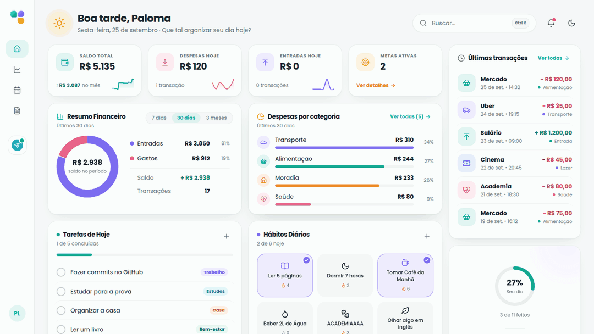
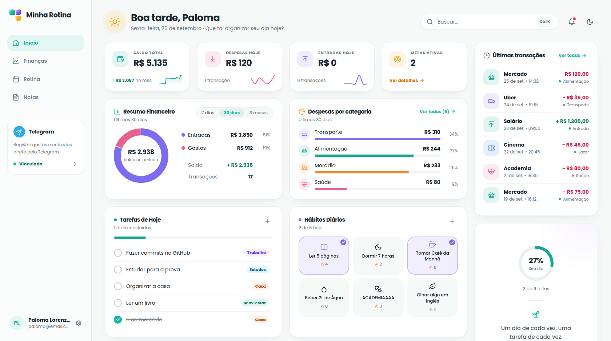
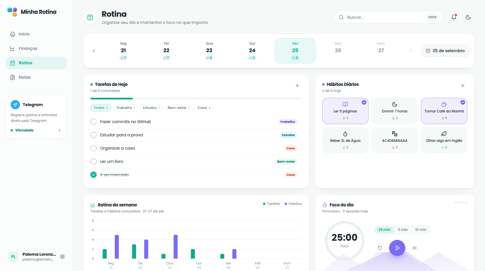
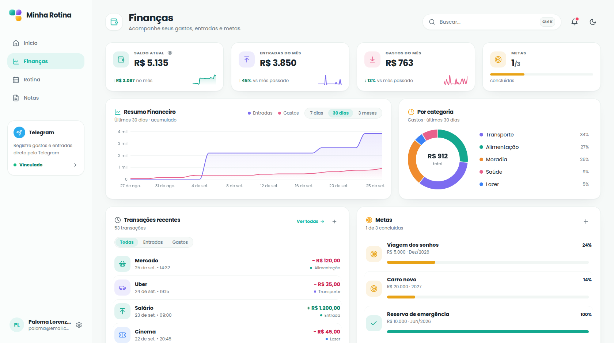
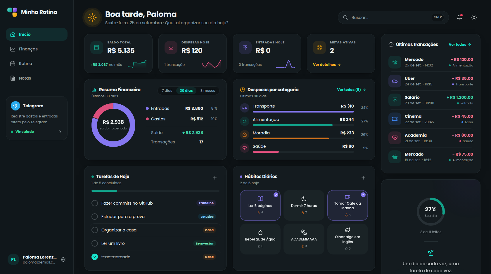
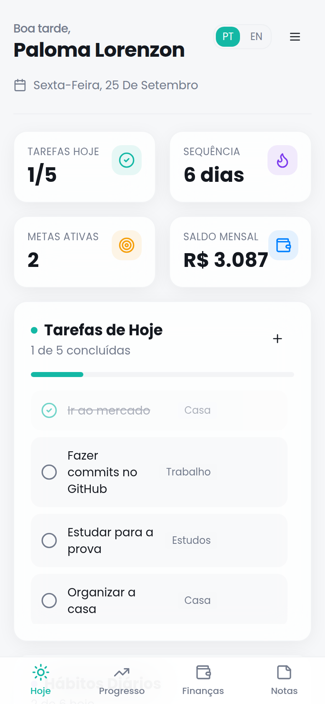

# Minha Rotina

**Sua vida inteira em um só lugar: tarefas, hábitos, foco, dinheiro e ideias.**


Um app para as tarefas, outro para os hábitos, uma planilha para os gastos e as ideias
perdidas num bloco de notas. O **Minha Rotina** junta tudo isso numa tela só. Você abre
de manhã e vê o seu dia inteiro: o que falta fazer, quais hábitos já marcou, quanto gastou
e quais contas vencem esta semana.

✨ **[Experimente online](https://dashboard-three-khaki-68.vercel.app/)**

### Veja funcionando

Marcar um hábito, concluir uma tarefa, buscar com `Ctrl + K`, ver os avisos de contas, ligar o Pomodoro e trocar para o tema escuro:



> "Não andeis ansiosos pelo dia de amanhã, pois o amanhã cuidará de si mesmo." (Mateus 6:34)

---

## Por que usar

- **Tudo em um só lugar.** Rotina e finanças lado a lado, na mesma conta, com a mesma cara.
- **Registre um gasto em 5 segundos.** Mande *"gastei 25 no almoço"* para o bot do Telegram e o gasto aparece no painel na hora.
- **Sempre atualizado.** O que muda no celular aparece no computador ao vivo, sem recarregar a página.
- **Feito para o celular e para o computador.** No celular é um app instalável, que abre até sem internet. No notebook e no monitor é um painel completo, com menu lateral.
- **Seus dados são só seus.** Você entra com a conta Google, e as regras de segurança do banco não deixam ninguém mais ler nada.



---

## O que tem dentro

### 🗓️ Rotina

- **Tarefas do dia** separadas por área (Trabalho, Estudos, Saúde, Casa...), com filtro por área e barra de progresso.
- **Hábitos diários** com sequência de dias 🔥, que zera sozinha se você pula um dia e dá para desmarcar sem perder a sequência.
- **Sua semana num relance:** quantas tarefas e hábitos você concluiu em cada dia, com gráfico e navegação pelas semanas anteriores.
- **O que eu fiz nesse dia?** Clique em qualquer dia da semana e veja tudo o que aconteceu: hábitos feitos, tarefas concluídas, quanto gastou e recebeu, metas que avançaram, focos no Pomodoro e notas criadas.
- **Foco do dia:** timer Pomodoro (25/5/15, pausa longa a cada 4 focos). Ele continua contando mesmo quando você troca de página e mostra o tempo na aba do navegador.



### 💰 Finanças

- **Saldo atual** e quanto sobrou no mês, com mini gráfico da evolução.
- **Entradas e gastos do mês**, comparados com o mês passado.
- **Gráfico de entradas x gastos** em 7 dias, 30 dias ou 3 meses.
- **Gastos por categoria** (Alimentação, Transporte, Moradia, Lazer, Saúde, Assinaturas).
- **Contas do mês** com vencimento: marque como paga e veja o que está vencido ou vencendo.
- **Metas** com barra de progresso (viagem, reserva de emergência, 12 livros no ano...).
- **Olhinho para esconder os valores** quando tiver alguém do lado ou você estiver compartilhando a tela.



### 🤖 Bot do Telegram

Vincule sua conta uma vez, direto pelo app, e registre gastos e entradas conversando:

| Você manda | O que acontece |
|---|---|
| `gastei 30 no mercado` | registra um gasto de R$ 30 |
| `recebi 2500 salário` | registra uma entrada de R$ 2.500 |
| `/gasto 30 mercado` · `/entrada 2500 salário` | o mesmo, com comando |
| `/ultimas` | mostra suas últimas transações |
| `/desfazer` | apaga a última transação registrada pelo bot |
| `/ajuda` | lista tudo que o bot entende |

### 📝 Notas

Post-its coloridos para ideias rápidas, lembretes e listas, num mural que se organiza sozinho.

### ✨ Os detalhes que fazem diferença

- **Busca em tudo** com `Ctrl + K`: tarefas, transações, contas, metas, hábitos, notas e páginas.
- **Sininho de avisos:** contas vencidas ou que vencem nos próximos dias, e o que ainda falta fazer hoje.
- **Tema claro e escuro.**
- **Português e inglês.**
- **Instalável (PWA):** vai para a tela inicial do celular, abre offline e sincroniza quando a internet volta.

<table>
  <tr>
    <td width="68%"></td>
    <td width="32%"></td>
  </tr>
  <tr>
    <td align="center"><sub>Tema escuro</sub></td>
    <td align="center"><sub>No celular</sub></td>
  </tr>
</table>

<sub>Telas reais do app, com dados de exemplo.</sub>

---

## 🛠️ Tecnologias

- **Frontend:** React, Vite, TypeScript, Tailwind CSS, shadcn/ui, Recharts
- **Autenticação:** Firebase Auth (login com Google)
- **Banco de dados:** Cloud Firestore, com cache offline e atualização ao vivo
- **Bot do Telegram:** funções serverless na Vercel (pasta `api/`) com Firebase Admin
- **Deploy:** Vercel

O app fala direto com o Firebase. O único código de servidor é o do bot do Telegram. Quem
garante que cada pessoa só alcança os próprios dados são as regras em
[`firestore.rules`](firestore.rules).

## 🚀 Rodando o projeto

### 1. Requisitos

- Node.js 20+
- Um projeto no [Firebase](https://console.firebase.google.com) com **Authentication → Google** ativado e um **Firestore** criado

### 2. Configuração

```bash
cp .env.example .env
```

Preencha com a config do seu projeto (Console → Project settings → Your apps → Web):

```env
VITE_FIREBASE_API_KEY=
VITE_FIREBASE_AUTH_DOMAIN=
VITE_FIREBASE_PROJECT_ID=
VITE_FIREBASE_STORAGE_BUCKET=
VITE_FIREBASE_MESSAGING_SENDER_ID=
VITE_FIREBASE_APP_ID=
```

Essas chaves são públicas por design: elas identificam o projeto, não autorizam nada.

Publique as regras de segurança do arquivo `firestore.rules` no console (Firestore Database → Rules) e adicione seus domínios em Authentication → Settings → Authorized domains.

### 3. Execução

```bash
npm install
npm run dev
```

### 4. Bot do Telegram (opcional)

1. Crie um bot com o [@BotFather](https://t.me/BotFather) e guarde o token.
2. Na Vercel (Settings → Environment Variables), cadastre só no servidor e **sem** o prefixo `VITE_`:
   - `TELEGRAM_BOT_TOKEN`: o token do BotFather;
   - `TELEGRAM_WEBHOOK_SECRET`: um segredo inventado por você (letras, números, `_` e `-`);
   - `FIREBASE_SERVICE_ACCOUNT`: o JSON da conta de serviço do Firebase, numa linha só.
3. Depois do deploy, ligue o bot ao app (uma vez por ambiente):

```bash
TELEGRAM_BOT_TOKEN=... TELEGRAM_WEBHOOK_SECRET=... \
  node scripts/telegram-webhook.mjs https://seu-app.vercel.app
```

4. No app, clique em **Conectar** no card do Telegram, gere o código e mande `/start CODIGO` para o bot.

### Outros comandos

```bash
npm test       # testes
npm run lint   # análise estática
npm run build  # build de produção
npm run icones # regenera ícones e telas de abertura a partir de public/logo.svg
```

## 🔒 Segurança

- **Login com Google**, sem senha guardada em lugar nenhum
- **Isolamento por usuário:** todo dado mora em `users/{uid}`, e as regras do Firestore só liberam o caminho de quem está logado. Isso é verificado no servidor a cada leitura e escrita
- **Telegram vinculado por código temporário:** o bot só grava para quem provou ser dono da conta, e segredos como token e conta de serviço nunca vão para o navegador
- **Sessão persistente**, guardada pelo próprio Firebase

## 📁 Estrutura

```
src/
├── desktop/           layout de notebook e monitor (menu lateral, páginas e cards)
├── components/        layout do celular, logo, splash e widgets
├── pages/             login, Início, Finanças, Rotina/Progresso, Notas, conta
├── lib/
│   ├── firebase.ts    inicialização do Firebase
│   ├── db.ts          leitura e gravação no Firestore
│   ├── aoVivo.ts      dados ao vivo compartilhados entre os cards
│   ├── dates.ts       "que dia é hoje", no fuso local
│   └── habits.ts      sequência e "feito hoje"
└── contexts/          autenticação e idioma
api/                   bot do Telegram (funções da Vercel)
firestore.rules        regras de segurança
```

## 📩 Contato

[](https://www.linkedin.com/in/palomagl)
[](https://wa.me/5551998127367)

---

> Feito para quem quer a vida organizada sem precisar de cinco apps diferentes.
